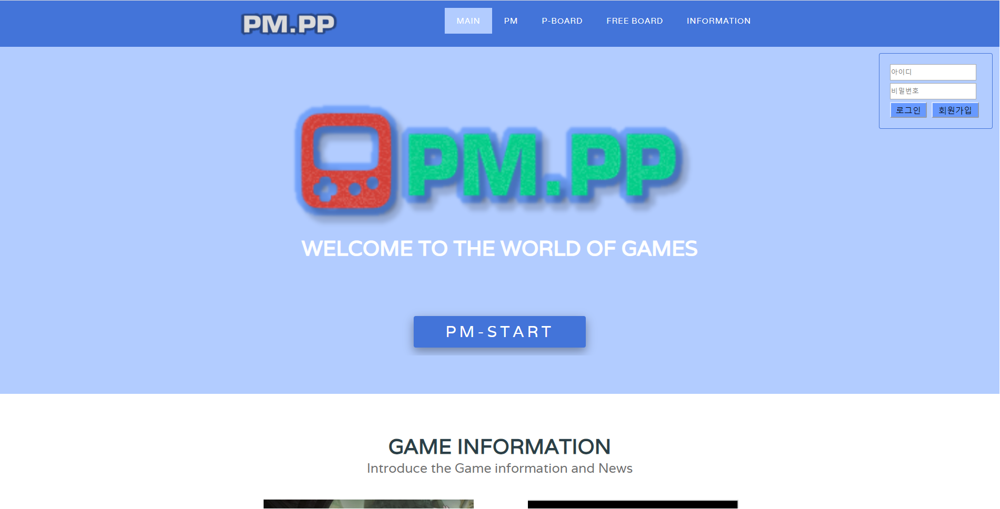

# PM.PP (MVC기반 웹 프로젝트)
### 1. 프로젝트 정보

\- 프로젝트명 : PM.PP

\- 프로젝트 기간 : 2016. 09 ~ 2016. 12

\- 참여 인원수 : 2명

\- 본인 역할 : Full-Stack 개발 및 총괄

\- 프로젝트 설명 : PM.PP는 게임 웹서비스 플랫폼으로 실시간으로 게임상에서 사람들이 파티원을 구할 때 웹을 통하여 파티원을 모집하거나 파티를 맺을 수 있는 서비스입니다. 또한 다양한 게임 정보를 제공하고 있습니다.

\- 개발 환경 : **Eclipse**, Atom

\- 개발 기술 : Front(**JS**, Html, Css), Back(**Spring**, Mysql, Tomcat), TCP/IP Socket 통신

\- 성과 : 처음으로 대학교에서 웹이라는 프로젝트를 진행함으로써 웹에서 어떻게 서비스가 이루어지고 통신이 어떻게 이루어지는지 등을 자세하게 알 수 있는 계기가 되었습니다. 또한 유저들에게 직접 서비스를 한다는 마음가짐으로 개발에 참여함으로써 사용자들의 편의성, UI, UX 등을 고려하면서 개발하다 보니 개발의 방향성에 대해 구체적으로 생각해보는 계기가 되었습니다.


### 2. 설치방법

```
Eclipse Import
```


<br>

